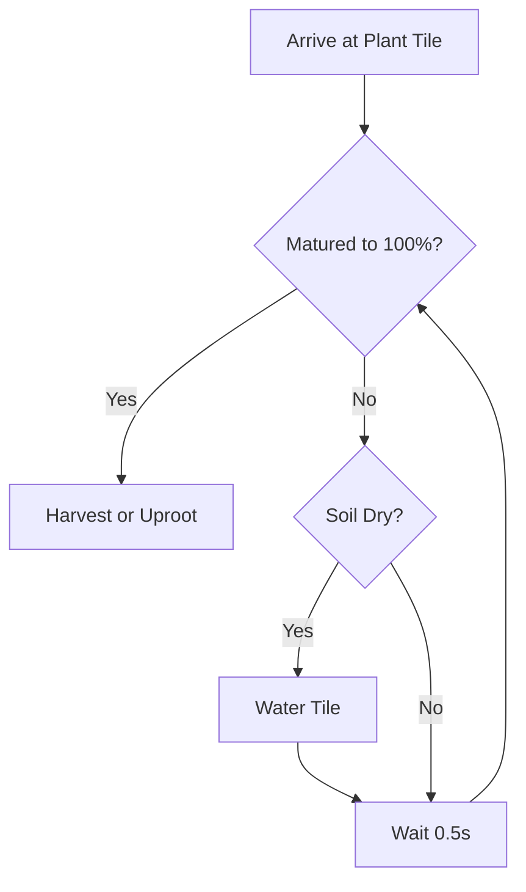

# Drone Automation Architecture & Algorithm Specification

This document details the high-efficiency, non-blocking asynchronous farming drone control algorithm implemented for the Lau farming system.

---

## 1. Core Architectural Pillars

The system operates on three foundational principles to maximize efficiency:
1. **Asynchronous Parallel Processing (`--!ndrone`)**: Instructs the compiler to run non-physical operations (sensor reading, water level tracking, state changes, UI logs) in parallel while the drone performs physical actions.
2. **Safe Animating State Machine (`wD()`)**: Guarantees that overlapping movement and tool commands are queued safely by explicitly polling and waiting for `Enum.DroneStatus.Sleep` before firing the next physical action.
3. **Direct Path Navigation (`droneV2.goto`)**: Bypasses slow step-by-step grid movements. The drone utilizes the native navigation subsystem to fly directly to target coordinates, allowing for faster and potentially diagonal travel.
4. **Dynamic Sensor-Driven State**: Avoids brittle, hardcoded crop rules. The drone dynamically queries the soil and plant to determine whether a crop is a fruit-bearing tree or an uprootable plant.

---

## 2. The Multi-Phase Sweep Loop

Rather than uniformly traversing the grid on every sweep, the system alternates between two different sweeping algorithms:

```
Cycle:  [Full Scan] ➔ [Tree Scan] ➔ [Tree Scan] ➔ [Tree Scan] ➔ [Tree Scan] (Repeat)
          (1 time)      (4 times)     (4 times)     (4 times)     (4 times)
```

### A. Full Scan Sweep (1/5 Iterations)
* **Goal**: Discover changes in the field, harvest ready plants, uproot completed crops, and plant new seeds.
* **Mechanism**: 
  1. The loop executes a complete snake-like traversal of all $N \times N$ tiles.
  2. If the field is missing seeds, the drone purchases up to 20 seeds synchronously (avoiding infinite buy loops).
  3. Every tile is analyzed, watered if needed, and replanted if empty.

### B. Tree-Only Fast Sweep (4/5 Iterations)
* **Goal**: Zoom directly to growing plants and wait for them to finish, skipping all empty tiles.
* **Mechanism**:
  1. The drone checks its internal field model table (`fld`).
  2. If a tile's coordinates are marked as `"empty"`, the drone completely skips moving to it.
  3. The drone flies directly to tiles marked `"planted"` or `"ready"`, minimizing flight paths and cutting traversal overhead.

---

## 3. Algorithmic Flowcharts & Execution

### Grid Traversal Snake Compression
To keep the module lean and prevent script memory crashes, the grid pathing uses a unified mathematical step-multiplier:

$$\text{cS} = \begin{cases} 
      1 & \text{if row index } r \text{ is even} \\
      -1 & \text{if row index } r \text{ is odd} 
   \end{cases}$$

This lets us write one single `while` loop for column movement that automatically reverses direction every row:
```lua
var c, cE, cS = gMin, gMax, 1
if (r - gMin) % 2 ~= 0 then
    c, cE, cS = gMax, gMin, -1
end
while c * cS <= cE * cS do
    -- Visit tile (c, r)
    c = c + cS
end
```

### Hover & Growth Synchronization Loop
During fast tree-scans, if a crop has not fully matured, the drone hovers in place and uses a polling wait loop. To ensure the crop doesn't freeze its growth due to dry soil, the drone dynamically monitors and waters the tile *while* it waits:



---

## 4. Key Functions Specification

| Function Name | Return Type | Description |
|:---|:---|:---|
| `wD()` | `void` | Standard sleep safety wrapper. Pauses execution until physical drone finishes current animation. |
| `hasSeed(seed)` | `boolean` | Scans player inventory for seed matches. Only runs on Full Scans to avoid 10s network lag spikes during fast sweeps. |
| `buyMax()` | `void` | Safely purchases seeds in small batches (max 20) with yield delays to protect the game thread. |
| `waitForGrowth(isFruit)` | `void` | The hover-and-wait engine. Periodically checks plant/fruit percent and auto-waters while hovering. |
| `doTile(c, r, cp, tOnly)` | `boolean` | Processes actions for a single tile. Returns `true` if any physical action (plant, harvest, crop, water) was taken. |
| `sweep(cp, tOnly)` | `boolean` | Initiates grid sweeps. Alternates traversing methods based on the `tOnly` flag. |

---

## 5. Efficiency Gains

1. **Traversal Optimization**: Skipping empty tiles allows the drone to take direct diagonal paths between growing plants rather than wasting battery pacing a grid.
2. **CPU and Network Protection**: Moving `hasSeed()` checks and `buyMax()` loops strictly into the Full Scan step removes the persistent 10-second lag freeze from fast scans.
3. **No Wasted Idle Cycles**: Hovering in place until a plant grows guarantees that the drone never loops dry-runs, keeping harvesting perfectly synchronized with the farm's native growth rates.
